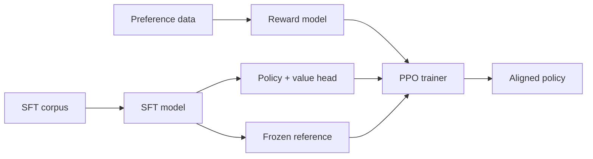

# RLHF-PPO

A production-grade **Reinforcement Learning from Human Feedback** pipeline built
around a from-scratch **Proximal Policy Optimization** implementation — SFT →
reward modeling → PPO, with monitoring, security, and a documented threat model.

[](https://github.com/rlhf-ppo/rlhf-ppo/actions/workflows/ci.yml)

## 1. Architecture overview



- **Policy** (`rlhf.models.policy`) — causal LM + value head; one forward pass
  yields logits **and** per-token values.
- **Reward model** (`rlhf.models.reward_model`) — Bradley-Terry head with
  last-token pooling; optional uncertainty ensemble.
- **Reference** (`rlhf.models.reference_model`) — frozen SFT snapshot for the KL
  penalty.
- **PPO** (`rlhf.training.ppo`) — clipped surrogate + clipped value loss +
  entropy bonus; vectorized GAE; adaptive KL controller.

Full docs: `make docs` (MkDocs + mkdocstrings) → see `docs/`.

## 2. Prerequisites

| Requirement | Notes |
|---|---|
| Python | ≥ 3.10 (CI targets 3.11) |
| CUDA | 12.x for GPU training (CPU works for tests / toy runs) |
| VRAM | ~24 GB for a 1B policy in bf16 with a frozen reference; 8-bit/4-bit loading via `bitsandbytes` to reduce |

PPO holds policy + reference + reward model in memory simultaneously; budget
roughly 3× the policy footprint (less if the reward backbone is shared/quantized).

## 3. Installation

```bash
git clone https://github.com/rlhf-ppo/rlhf-ppo && cd rlhf-ppo
make dev                       # editable install + dev + monitoring extras
pre-commit install || true     # optional: ruff/mypy pre-commit hooks
```

## 4. Quickstart

```bash
python -m rlhf sft    --config config.yaml   # stage 0
python -m rlhf reward --config config.yaml   # stage 1
python -m rlhf ppo    --config config.yaml   # stage 2
```

See [docs/guides/quickstart.md](docs/guides/quickstart.md) for a minimal config
and the JSON-lines data formats.

## 5. Configuration

All keys live in `rlhf.config.schema` (Pydantic-validated). Highlights:

| Key | Default | Description |
|---|---|---|
| `ppo.clip_eps` | 0.2 | PPO policy-ratio clip ε |
| `ppo.clip_eps_vf` | 0.2 | Value-prediction clip |
| `ppo.entropy_coeff` | 0.01 | Entropy bonus c₂ |
| `ppo.value_coeff` | 0.5 | Value-loss coefficient c₁ |
| `ppo.gamma` / `ppo.lam` | 1.0 / 0.95 | GAE discount / smoothing |
| `ppo.ppo_epochs` | 4 | Optimization epochs per rollout |
| `ppo.rollout_batch_size` | 64 | Prompts per rollout |
| `ppo.mini_batch_size` | 8 | Mini-batch for each gradient step |
| `ppo.kl_target` / `kl_init` | 6.0 / 0.2 | Target KL / initial β |
| `ppo.kl_adaptive` | true | Adaptive vs fixed KL controller |
| `ppo.kl_abort_threshold` | 30.0 | Abort if KL exceeds this |
| `ppo.reward_hacking_threshold` | 0.5 | Abort on reward dispersion above this |
| `ppo.learning_rate` | 1.4e-5 | AdamW LR |
| `ppo.lr_scheduler` | cosine | cosine / linear / constant |
| `ppo.max_new_tokens` | 256 | Generation length |
| `reward_model.ensemble_size` | 1 | Reward-model ensemble size |
| `model.dtype` | bfloat16 | float32 / bfloat16 / float16 |
| `device` | cpu | torch device string |

Defaults for each stage live in `src/rlhf/config/defaults/`. Override via YAML,
construction, or env vars (prefix `RLHF_`, nested delimiter `__`).

## 6. Monitoring

- **W&B:** set `wandb_project` in the config (and `WANDB_API_KEY`); open the
  project dashboard.
- **TensorBoard:** logs land in `<output_dir>/tb` →
  `tensorboard --logdir outputs/tb`.

Every PPO step logs policy/value/entropy losses, exact + approx KL, clip
fraction, explained variance, gradient norm, LR, β, reward mean/std/min/max,
reward-hacking score, and response-length stats. `monitoring.alerts.AlertManager`
raises on KL spikes, reward hacking, NaN losses, entropy collapse, and gradient
explosions.

## 7. Troubleshooting

| # | Symptom | Fix |
|---|---|---|
| 1 | KL explodes / `KLDivergenceExceeded` | lower `learning_rate`, lower `kl_target` |
| 2 | `RewardHackingDetected` | lower `kl_target`; enable ensemble; raise threshold if false positive |
| 3 | `explained_variance` negative | lower value LR; check `value_coeff` |
| 4 | Entropy → 0, repetitive output | raise `entropy_coeff`; lower LR |
| 5 | `NumericalInstabilityError` (NaN) | use bf16 not fp16; lower LR; gradient clipping is on by default |
| 6 | OOM | reduce `rollout_batch_size`/`mini_batch_size`; raise `gradient_accumulation_steps`; 8/4-bit loading |
| 7 | `CheckpointTamperingError` | checkpoint digest mismatch — restore a known-good checkpoint |
| 8 | `PromptInjectionError` | a prompt hit the blocklist; review / adjust `security.injection_blocklist` |
| 9 | Reward never improves | leash too tight (raise `kl_target`); verify RM accuracy |
| 10 | Tokenizer download fails offline | pre-cache the tokenizer or point to a local path |

## 8. Contributing

- **Branching:** feature branches off `main`; PRs require green CI + review per
  `CODEOWNERS`.
- **Commits:** Conventional Commits (`feat:`, `fix:`, …) — `release.yml` derives
  versions via semantic-release.
- **PR checklist:** `ruff check` + `ruff format --check` + `mypy src/` clean;
  `pytest -m "not gpu"` green with ≥90% coverage; docs build (`make docs`).

## 9. Security

Report vulnerabilities per [`SECURITY.md`](SECURITY.md). The implemented threat
model (reward poisoning, prompt injection, checkpoint tampering, reward hacking,
privilege escalation, supply chain) is documented in
[docs/architecture/overview.md](docs/architecture/overview.md).

## 10. License

Apache-2.0.
