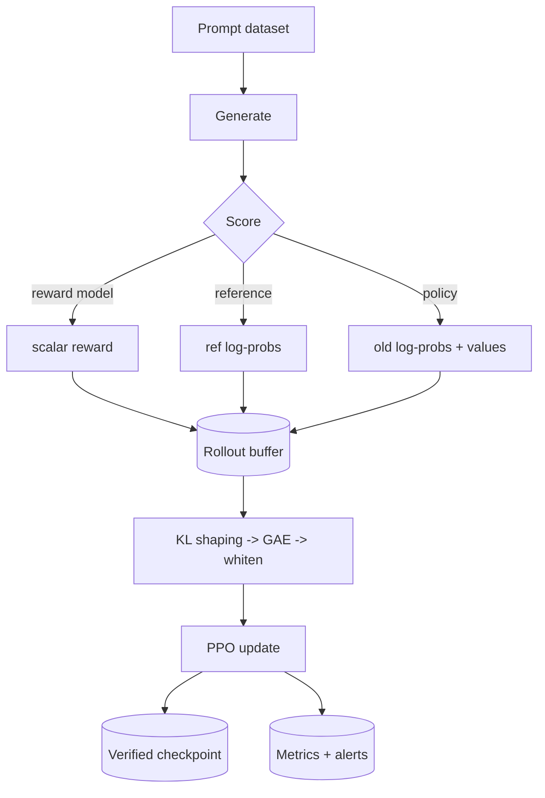

# System Overview & Threat Model

## Components

| Component | Module | Responsibility |
|---|---|---|
| Policy (+ value head) | `rlhf.models.policy` | Generate responses; produce logits + per-token values in one pass |
| Reward model | `rlhf.models.reward_model` | Scalar preference score (last-token pooling); optional ensemble |
| Reference model | `rlhf.models.reference_model` | Frozen SFT snapshot for the KL penalty |
| Rollout buffer | `rlhf.training.ppo.rollout` | Store rollouts, shape rewards, compute GAE |
| PPO trainer | `rlhf.training.ppo.trainer` | Orchestrate the 5-phase loop |
| Monitoring | `rlhf.monitoring` | Dual W&B/TensorBoard logging + anomaly alerts |
| Security | `rlhf.security` | Checkpoint integrity + prompt-injection guards |

## Data flow

## Threat model

| Threat | Attack vector | Mitigation (implemented) |
|---|---|---|
| Reward-model poisoning | Malicious annotator injects swapped preferences | Ensemble uncertainty (`reward/ensemble_std`); annotator-id provenance in `Preference`; poisoning raises the BT loss floor (detectable) |
| Prompt injection in training data | Adversarial prompts that exfiltrate secrets via generations | `security.validation.sanitize_prompt` strips control chars, truncates, and blocks known injection patterns |
| Checkpoint tampering | Replacing weights on disk to alter behaviour | `security.audit.CheckpointVerifier` SHA-256 manifest, verified on load (`CheckpointTamperingError`) |
| Reward hacking | Policy finds degenerate inputs that fool the reward model | KL penalty to reference; ensemble std canary; dispersion ratio + saturation ceiling early-stop (`RewardHackingDetected`) |
| Privilege escalation | Training container running as root | Dockerfile runs as non-root UID 10001; Helm `securityContext` drops all capabilities |
| Supply-chain attack | Malicious dependency | `pip-audit` + Bandit + Trivy image scan in CI; pinned dependency ranges |

## Reproducibility & determinism

Every training script seeds Python/NumPy/PyTorch (`rlhf.utils.set_seed`,
`deterministic=True`), logs `torch`/`transformers` versions and the full config
(`reproducibility_info`), and checkpoints RNG + optimizer + scheduler + KL state
so a resumed run reproduces a continuous one bit-for-bit (verified in
`tests/integration/test_checkpoint_resume.py`).
