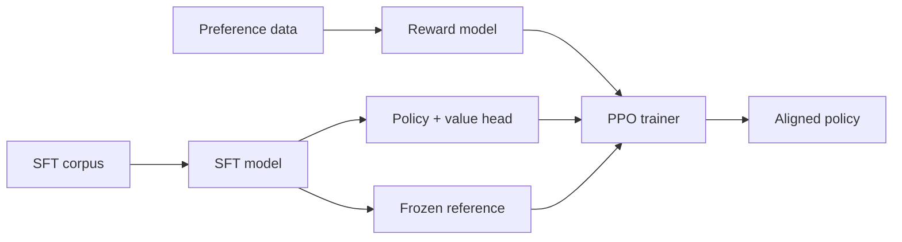

# RLHF-PPO

A production-grade **Reinforcement Learning from Human Feedback** pipeline built
around a from-scratch **Proximal Policy Optimization** implementation.

The pipeline has three stages:

1. **SFT** — supervised fine-tuning of a base causal LM (stage 0).
2. **Reward modeling** — Bradley-Terry training on human preference pairs,
   optionally as an uncertainty ensemble.
3. **PPO** — policy optimization against the reward model with a KL penalty to a
   frozen reference, GAE advantages, and a clipped surrogate objective.

## Where to start

- New here? Read the [Quickstart](guides/quickstart.md).
- Want the math? See the [PPO Algorithm](architecture/ppo_algorithm.md).
- Operating a run? See [Training Run](guides/training_run.md) and
  [Hyperparameter Tuning](guides/hyperparameter_tuning.md).
- Security posture and threat model: [Overview](architecture/overview.md).

## Design decisions

The non-obvious choices are recorded as ADRs:
[PPO over REINFORCE](adr/001-ppo-over-reinforce.md),
[separate value head](adr/002-separate-value-head.md),
[adaptive KL controller](adr/003-kl-controller-adaptive.md),
[reward-model ensemble](adr/004-reward-model-ensemble.md).
